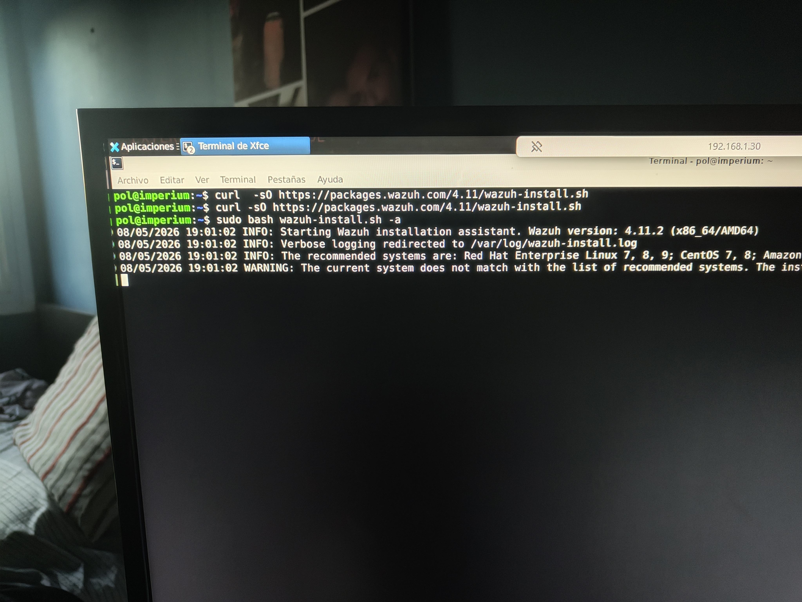
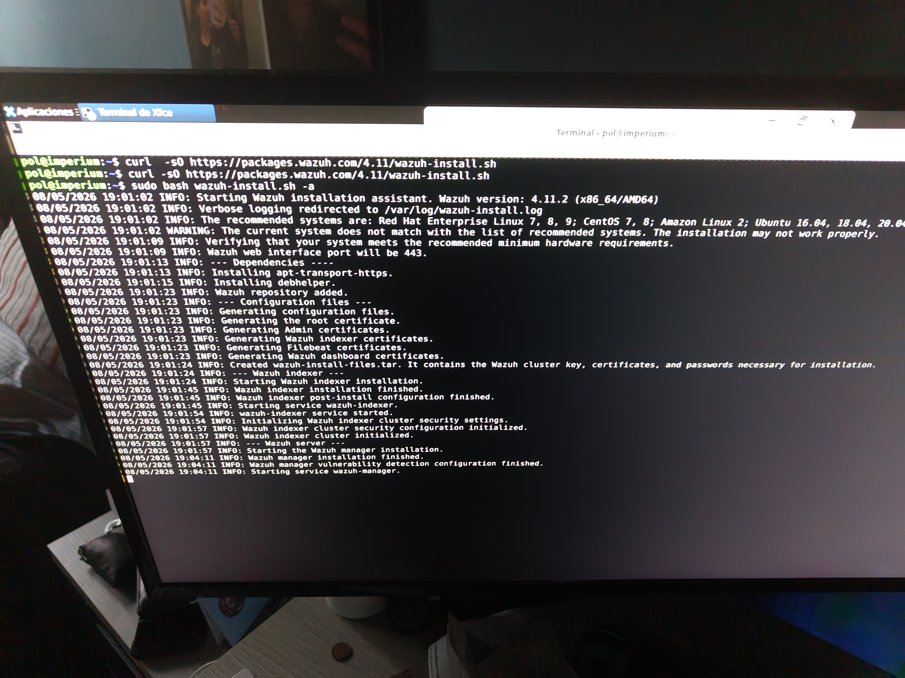

# Wazuh deployment

Wazuh is used as the central SIEM/XDR platform in this homelab.

## Current setup

- Wazuh manager installed on Ubuntu server
- Debian node connected as agent
- Log collection enabled
- Basic intrusion detection active
- SSH monitoring enabled

## Screenshots

### Dashboard

### Agent installation

### Active agents

### Example alert

