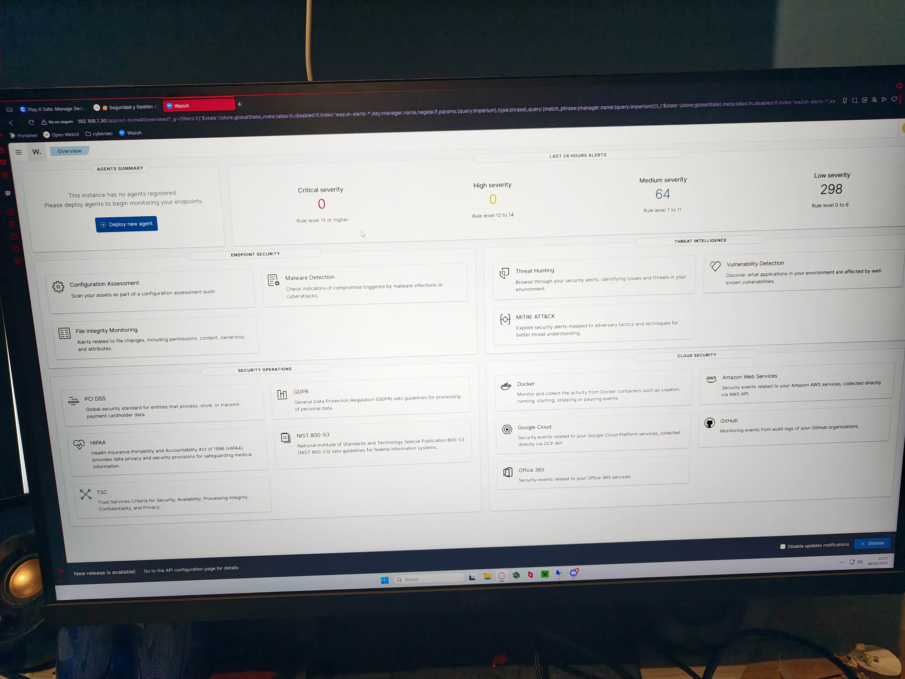
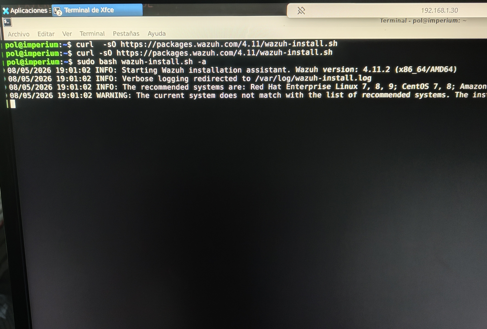
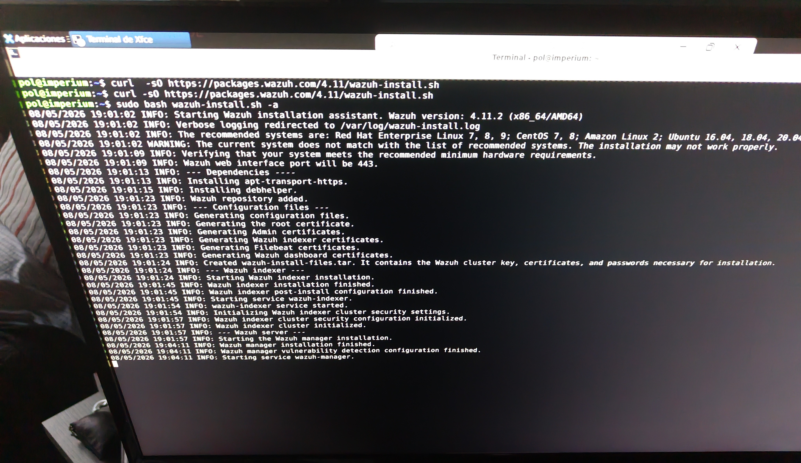
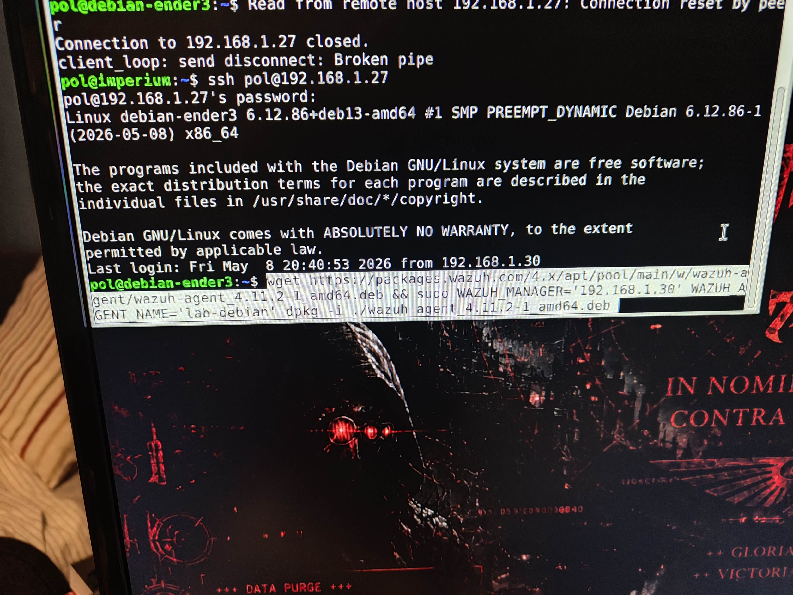
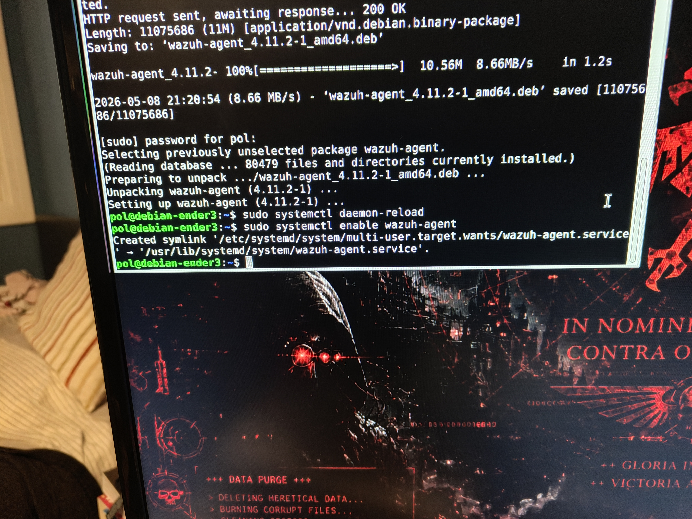
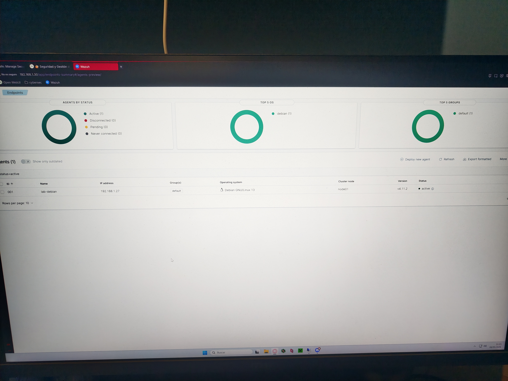
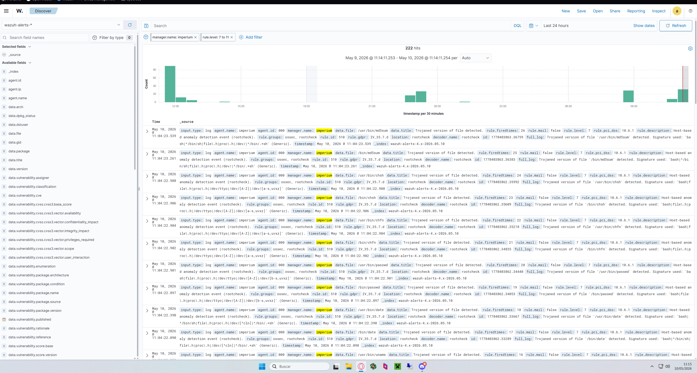
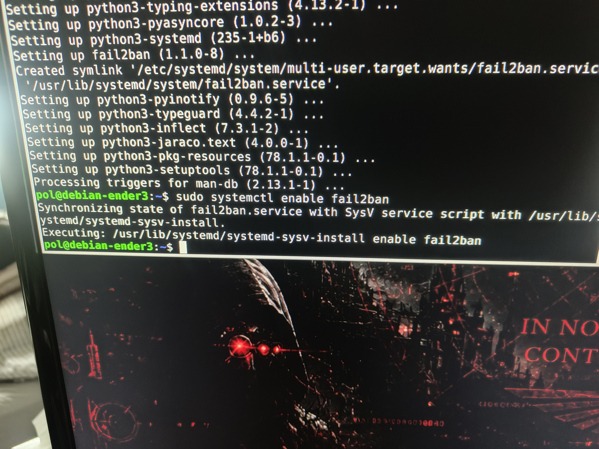
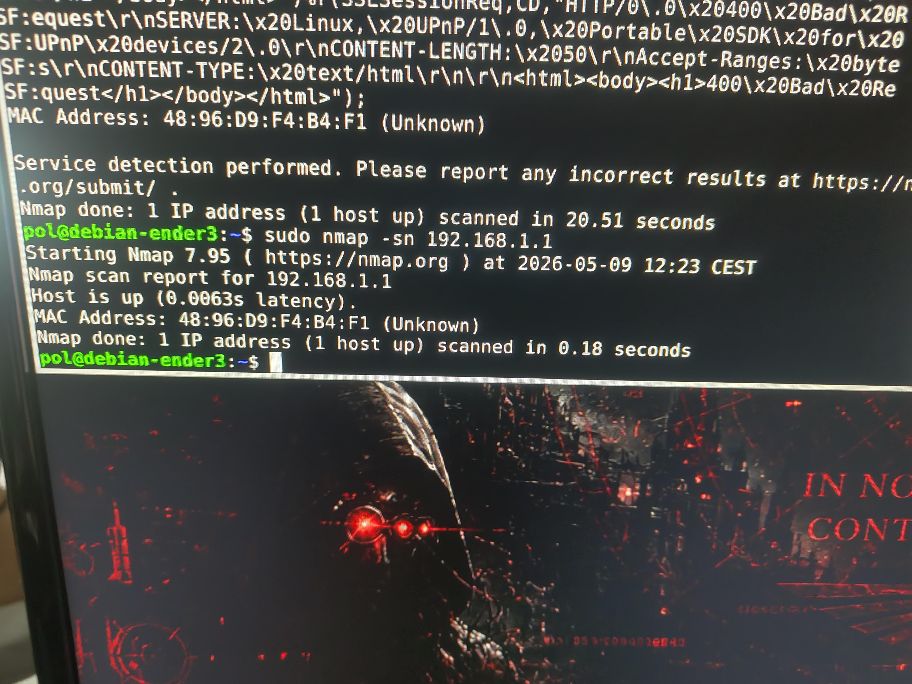

# Wazuh deployment

Wazuh is used as the central SIEM/XDR platform in this homelab.

## Current setup

- Wazuh manager installed on Ubuntu server
- Debian node connected as agent
- Log collection enabled
- Basic intrusion detection active
- SSH monitoring enabled

## Skills learned
- Linux administration
- SIEM deployment
- Network monitoring
- Agent management
- SSH remote administration
- Log analysis
- Security event investigation

## Additional tools
Extra security and networking tools used in the homelab enviornment.
- Fail2Ban for SSH brute-force protection
- Nmap for network scanning and host discovery

## Screenshots

### Dashboard

### Agent installation

### Active agents

### Example alert

### Fail2Ban and Nmap tools as an extra

