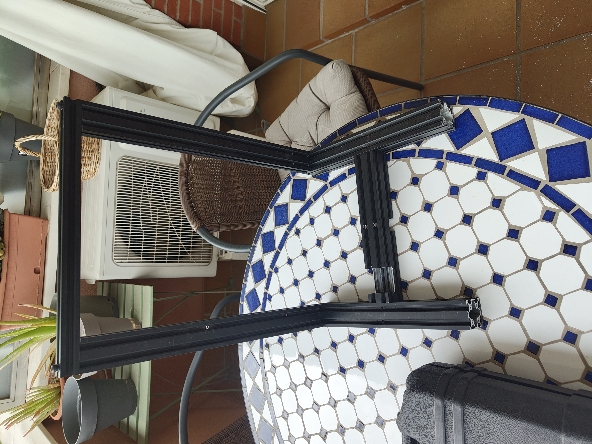
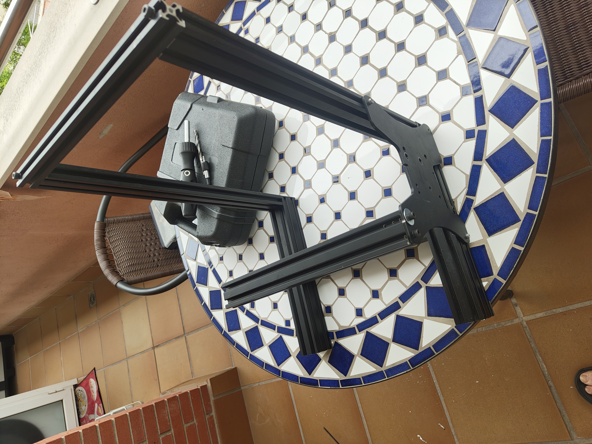
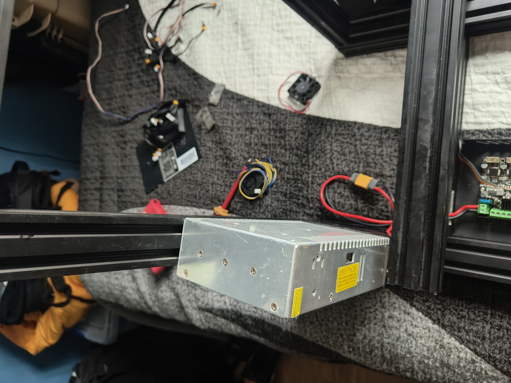
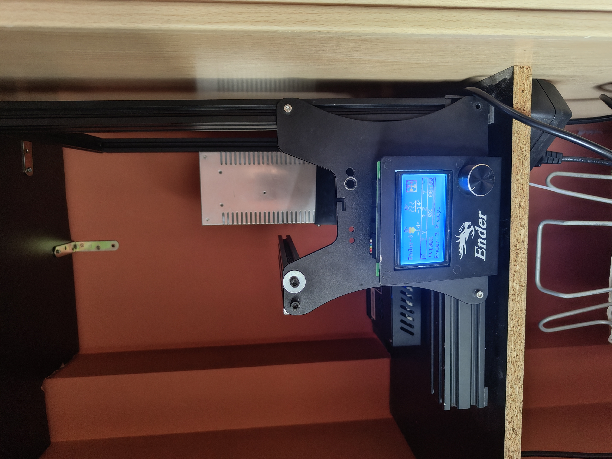

# Hardware Build

## Reusing an old Ender 3 frame

I decided to reuse the aluminum frame and electronics from an old Ender 3 printer to create the physical structure for my cybersecurity homelab node.

The main goals were:

- Recycle old hardware
- Save money
- Learn mechanical assembly
- Build a modular structure
- Create a custom node chassis for future upgrades

---

# Build Process

## 01 - Parts Layout

Initial disassembly and preparation of the printer frame components.

---

## 02 - Base Frame Assembly

Building the first structural base using the aluminum profiles.

---

## 03 - Vertical Frame Structure

Mounting the vertical supports and testing frame dimensions.

---

## 04 - Cross Support Installation

Adding horizontal support beams for improved stability.

---

## 06 - Mainboard Integration

Original Ender 3 electronics reused for testing and power distribution experiments.

---

## 07 - Power Supply Mounting

Initial PSU positioning and cable management testing.

---

## 08 - Structure Reinforcement

Additional adjustments to improve rigidity and modularity.

---

## 09 - Current Location / Setup

Current state and physical placement of the node structure.

---

# Notes

This structure is still under active development.

Future plans include:

- Installing server hardware
- Adding cooling and airflow management
- Cable routing improvements
- Mounting network equipment
- Integrating monitoring systems
- Expanding the homelab infrastructure
