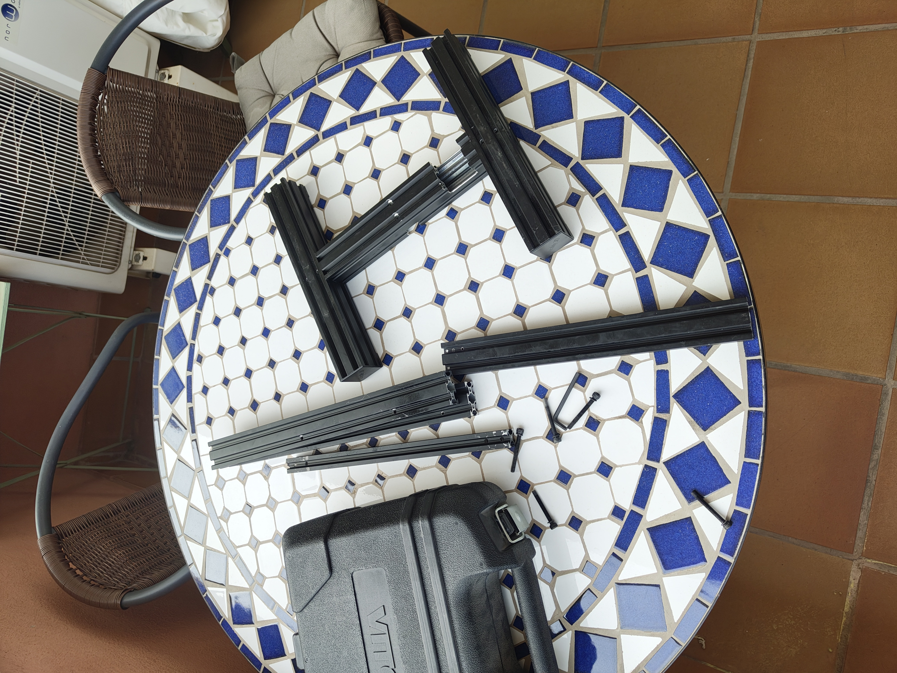
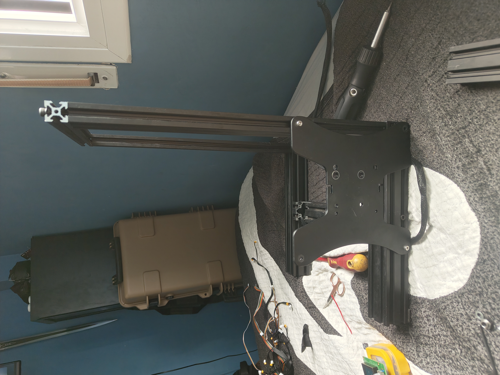

# Hardware Build

## Reusing an old Ender 3 frame

I decided to reuse the aluminum frame and electronics from an old Ender 3 printer to create the physical structure of my homelab node.

The goal was:
- Save money
- Recycle old hardware
- Learn mechanical assembly
- Create a modular structure for future upgrades

---

## Initial disassembly

Old printer frame separated into usable aluminum profiles.

---

## First structure assembly

Testing frame dimensions and stability.

---

## Vertical support structure

Main structure mounted.

---

## Electronics integration

Original Ender 3 electronics reused temporarily for testing and power distribution experiments.

---

## PSU mounting

Initial PSU positioning and cable testing.

